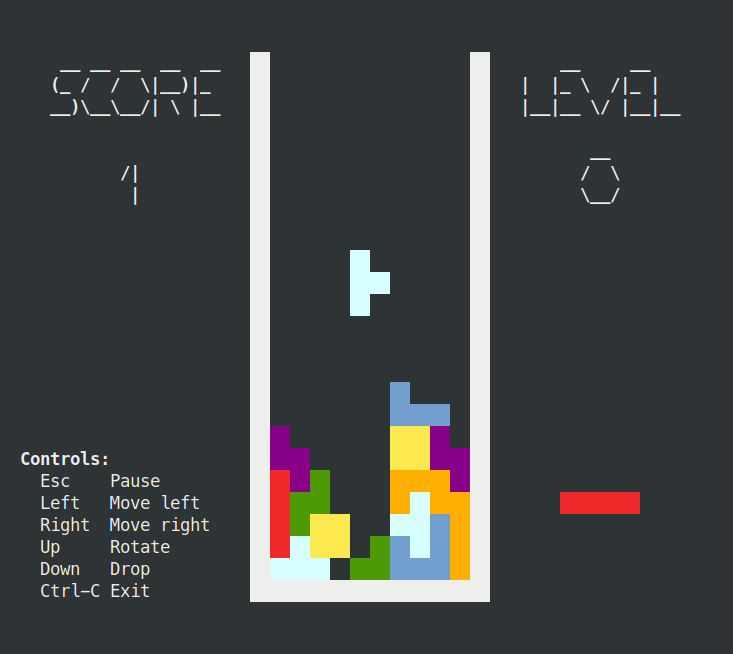

# Tetrominos

## Modes

### Full Mode

### Compact Mode

To run in the compact mode, use the `-compact` argument.

## Controls

`Ctrl-C` - Exit

### Start Screen

`Esc` - Start game

### Game Screen

`Esc`    - Pause

`Left`   - Move left

`Right`  - Move right

`Up`     - Rotate left

`Down`   - Rotate right

`Enter`  - Drop

`Ctrl-C` - Exit

### Pause Screen

`Esc` - Resume game

### Game Over Screen

`Esc` - Start game
